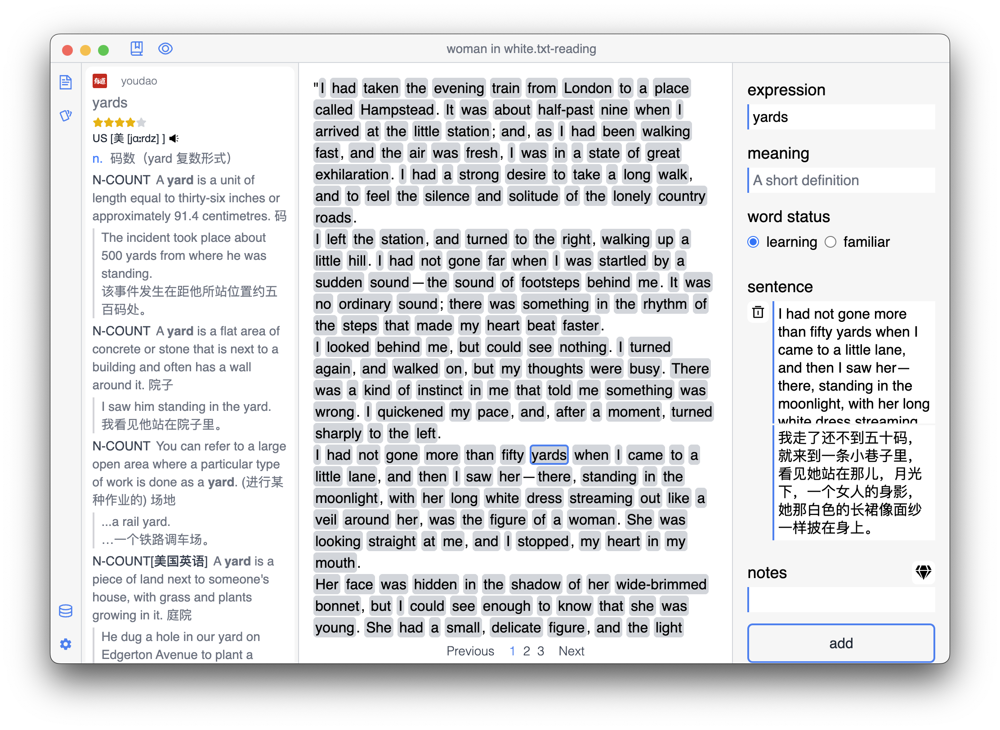
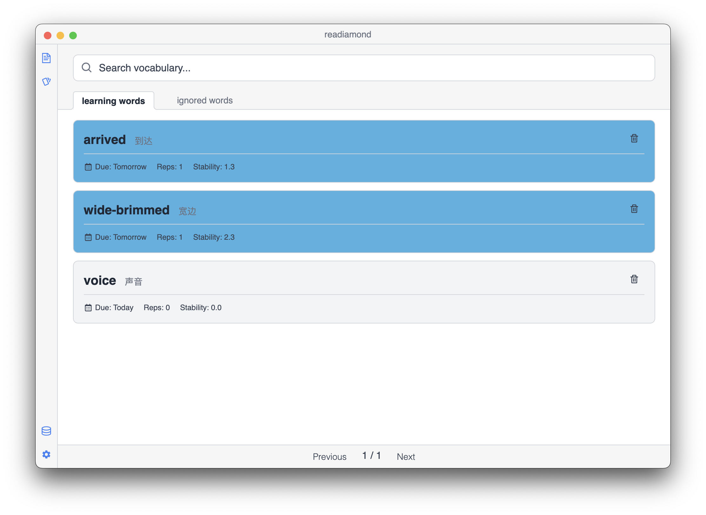
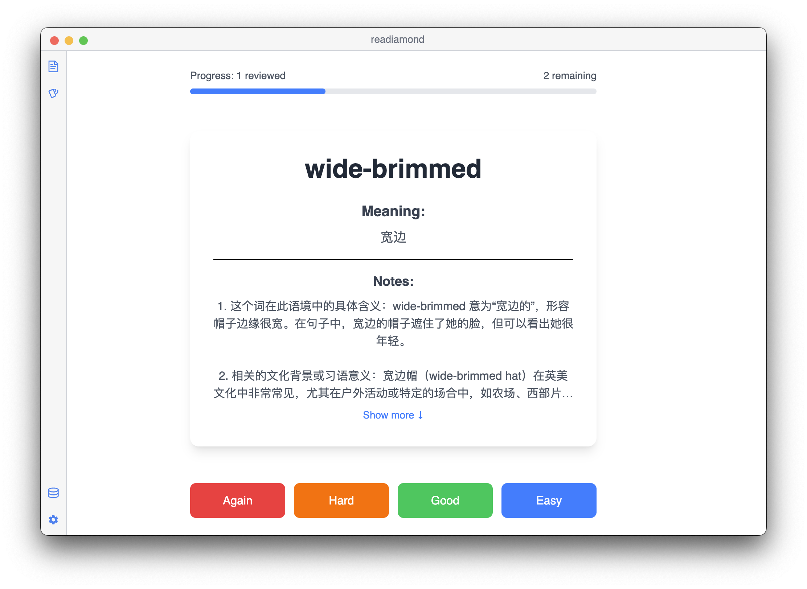
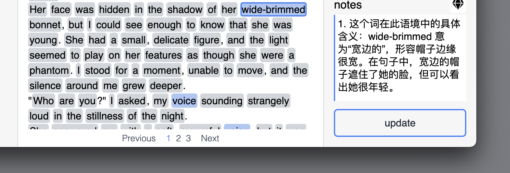
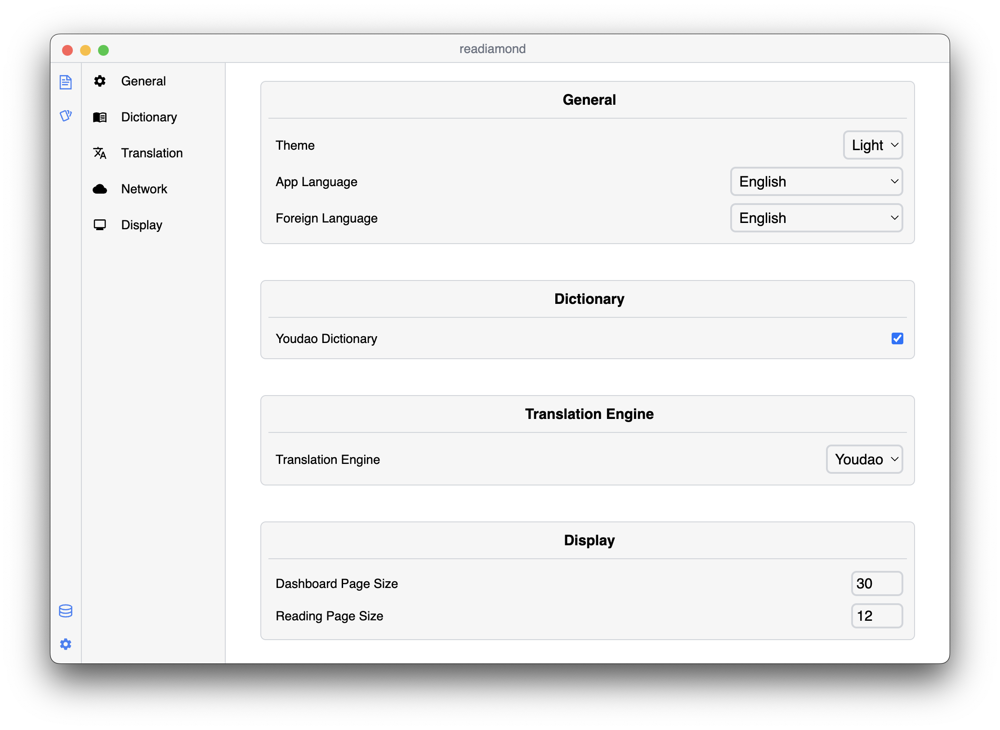

  
  
  # readiamond
  
  **An intelligent reading companion for language learning powered by FSRS and AI**
  
  Transform your reading into an immersive language learning journey
  
    
  

---

## Overview

readiamond is a desktop application designed for language learners who want to improve their reading skills. It combines a clean Markdown reader with powerful vocabulary learning tools, using spaced repetition algorithms to help you efficiently master new words while reading.

---

## Features

### Immersive Reading Experience

- **Smart File Management** - Tree view for organizing your reading materials, similar to Obsidian or VS Code
- **Beautiful Rendering** - Clean Markdown rendering optimized for long reading sessions
- **Night Mode** - Eye-friendly dark theme for comfortable reading
- **Smart Highlighting** - Familiar words are automatically highlighted based on your learning history

### Instant Dictionary Lookup

- **One-Click Translation** - Select any word to instantly view definitions, pronunciations, and examples
- **Multiple Sources** - Integrated with Youdao, Cambridge, and DeepL dictionaries
- **Context Preservation** - Save words along with their original sentences for better memorization
- **Editable Notes** - Edit and organize word definitions with your own insights

### Spaced Repetition Flashcards

- **FSRS Algorithm** - Scientific spaced repetition system for optimal memory retention
- **Auto-Generation** - Automatically create flashcards from your saved vocabulary
- **Progress Tracking** - Visual statistics to monitor your learning journey
- **Smart Review** - Review reminders based on your familiarity level

### AI-Enhanced Learning

- **Intelligent Explanations** - AI-powered word and phrase explanations
- **Context Analysis** - Understand words in their specific context
- **Example Sentences** - Get relevant, real-world usage examples

### Customizable Settings

- **Personalization** - Customize fonts, themes, and reading preferences
- **Keyboard Shortcuts** - Efficient workflow with customizable hotkeys
- **Data Management** - Easy import/export of your vocabulary and progress
- **Privacy First** - All data stored locally, no cloud sync required

---

## Download

| Platform | Download | Version |
|----------|----------|---------|
| macOS (Apple Silicon) | [Download](https://github.com/parsifal486/readiamond/releases) | v0.0.1-beta.2 |
| Windows | Coming Soon | coming soon |
| Linux | Coming Soon | coming soon |

The app supports auto-update and will notify you when a new version is available.

---

## Quick Start

### Installation

1. Download the latest version from the [Releases](https://github.com/parsifal486/readiamond/releases) page
2. Install the application:
   - **macOS**: Open the `.dmg` file and drag readiamond to Applications folder
   - **Windows**: Run the `.exe` installer
   - **Linux**: Install the `.AppImage` or `.deb` package
3. Launch readiamond and start your learning journey

### First Steps

1. Import your first document - Click the folder icon to add Markdown files
2. Start reading - Select a file from the sidebar to begin
3. Lookup words - Simply select any word to see its definition
4. Build your vocabulary - Click "Add" to save words to your personal database
5. Review with flashcards - Use the review feature to reinforce your learning

---

## Tech Stack

**Frontend**
- React 18 + TypeScript
- Tailwind CSS v4
- Redux Toolkit
- React Resizable Panels

**Desktop & Storage**
- Electron + Vite
- IndexedDB (Dexie)
- Electron Store
- Electron Updater

**Core Libraries**
- ts-fsrs - FSRS spaced repetition algorithm
- unified + retext-english - Text processing
- react-icons - Icon library

---

## Coming Features

- Unified alert component for consistent notifications
- Custom file path settings
- Enhanced keyboard shortcuts for flashcard review
- Advanced statistics and learning analytics
- PDF document support
- Audio pronunciation
- Multi-language support (Chinese, Spanish, French, etc.)
- Data sync with privacy protection
- Browser extension for learning while browsing
- Mobile apps (iOS and Android)
- Community features for sharing vocabulary lists
- Structured learning courses

---

## Contributing

Contributions are welcome! Here's how you can help:

- **Report Bugs** - Open an issue with detailed description
- **Suggest Features** - Share your ideas for improvements
- **Submit Pull Requests** - Help fix bugs or add features
- **Improve Documentation** - Help make documentation better

---

## License

This project is licensed under the MIT License - see the [LICENSE](./LICENSE) file for details.

---

## Contact

- **Author**: ryuTeakwoo
- **Email**: mrliuzeyou@outlook.com
- **Website**: [www.ryuteakwoo.com](https://www.ryuteakwoo.com)
- **Project Homepage**: [www.readiamond.ryuteakwoo.com](https://www.readiamond.ryuteakwoo.com)

---

  
Made with ❤️ by [ryuTeakwoo](https://github.com/parsifal486)

If you find this project helpful, please give it a ⭐

